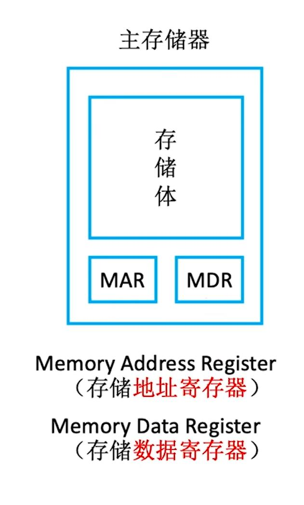
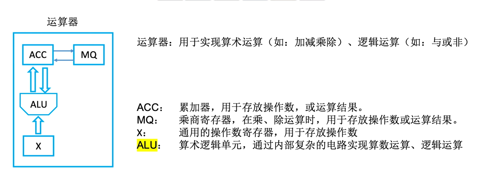
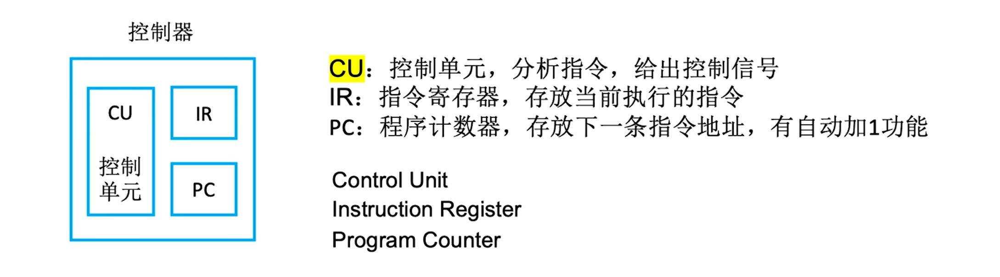

# 第一章
## 1.1 计算机发展历程
经历了电子管、晶体管、中小规模集成电路、超大规模集成电路四个时代。
摩尔定律：价格不变时，集成电路上能容纳的晶体管数目每隔18个月会增加一倍，整体性能也会提升一倍
存储器的发展也会遵从摩尔定律
计算机有两极分化的发展趋势。一极是微型计算机向更微型化、网络化、高性能、多用途的方向发展，另一极是巨星级向更巨型化、超高速、并行处理、智能化方向发展

## 1.2计算机系统层次结构
计算机系统由硬件和软件组成。

### 硬件
##### 计算机硬件基本组成
冯诺依曼在研究EDVAC机的时候提出了存储程序的概念，以此概念为基础的各类计算机统称为冯诺依曼机，其特点如下：
- 计算机硬件系统由运算器、存储器、控制器、输入输出设备五大部件组成
  - 输入设备：将信息转换为机器能识别的形式
  - 运算器：算术运算与逻辑运算
  - 存储器：存放数据和程序
  - 控制器：协调其他部件相互配合，解析存储器中的指令
  - 输出设备：将结果转换成人们熟悉的形式
- 指令与数据以同等地位存储在存储器中，可按地址寻访
- 指令和数据均用二进制代码表示
- 指令由操作码和地址码组成，操作码用来表示操作的性质，地址码用来表示操作数在存储器中的位置
- 指令在存储器内按顺序存放。通常指令是顺序执行的，在特定条件下可根据运算结果或根据设定的条件改变执行顺序
- 传统冯诺依曼结构以运算器为中心，输入输出设备通过运算器与存储器传送数据，数据传输要经过运算器作为中转
  - 现代计算机以存储器为中心，IO设备和运算器都从存储器读写数据，更多的解放了运算器

在计算机系统中，软件和硬件在逻辑上是等效的。对于同一个功能，既可以用软件实现，也可以用硬件实现。用软件实现成本和效率都更低，用硬件实现成本和效率都更高
运算器与控制器的关系十分紧密，在大规模集成电路出现以后，二者集成为CPU
$$硬件
\begin{cases}
    & \text{ 主机 }
    \begin{cases}
        & \text{ CPU }
        \begin{cases}
            & \text{ 运算器 } \\
            & \text{ 控制器 } 
        \end{cases} \\
        & \text{ 主存 }
    \end{cases} \\
    & \text{ IO设备 }
    \begin{cases}
        & \text{ 辅存 } \\
        & \text{ 输入设备 } \\
        & \text{ 输出设备 } 
    \end{cases}
\end{cases}
$$

##### 各个硬件的工作原理

**存储器**

CPU将想取得的数据的地址存到MAR，主存从存储体中取得数据，写到MDR，CPU取走数据
CPU将想写入的数据和位置放在MDR和MAR当中，主存向对应的位置写入数据
这个过程由控制总线传递指令
存储体是多个存储单元组成的，每个存储单元存储一串二进制数据，称为存储字，其位数为存储字长
MAR位数反映存储单元的位数，MDR位数等于存储字长
存储元是存储二进制的电子元件，每个存储元存储一个bit
在现代的CPU中，MAR和MDR常被集成到CPU中

**运算器**

**控制器**

完成一条指令经历三个阶段：
- 取指令，根据PC中的指令地址取出指令，放到IR中
- 分析指令，CU分析IR中的指令
- 执行指令，CU和其他部件控制指令的具体执行

前两个阶段也可合称取指
CPU区分数据和指令，是依据指令周期的不同阶段

### 软件
分为系统软件和应用软件两类。
系统软件是保证计算机系统高效正确运行的基础软件，用来管理整个计算机系统。例如操作系统、数据库管理系统、标准程序库、网络软件、语言处理程序、服务程序
应用软件是按人的需要编制成的各种程序

### 计算机的工作过程
计算机的工作过程分为三个步骤
1. 把程序和数据装入主存
2. 将源程序转换成可执行文件
3. 从可执行文件的首地址开始逐条执行指令

##### 从源程序到可执行文件
以unix系统中的gcc编译器程序为例，读取源文件hello.c，并把它翻译成一个可执行文件hello，整个翻译过程可分为四个阶段
1. 预处理阶段，把源文件中的注释去掉，对以#开头的预编译指令进行处理，例如将#include后面的头文件插入程序文件，生成一个源文件hello.i
2. 编译阶段，编译器把预处理后的源文件hello.i翻译成汇编语言文件hello.s
3. 汇编阶段，汇编器把汇编语言文件hello.s翻译成机器语言，将这些指令打包成一个可重定位目标文件的hello.o，它是一种二进制文件
4. 链接阶段，链接器把多个可重定位目标文件和库文件链接成一个完整的可执行文件hello

### 计算机层次结构

计算机分为五层结构
- M0微程序层，执行微指令
- M1传统机器语言层，执行机器语言指令
- M2操作系统层，向上提供广义指令
- M3汇编语言层，执行汇编语言
- M4高级语言层，执行高级语言

计算机语言分为三个级别
- 机器语言，计算机唯一可以直接识别和执行的语言，由0和1组成的二进制代码
- 汇编语言，是机器语言的助记符，用助记符表示机器指令，必须经过汇编程序的翻译转换成机器语言才能执行
- 高级语言，需要编译器转换成汇编语言或解释器转换成机器语言才能执行，是人类易于理解和使用的语言

## 1.3计算机的性能指标
### 机器字长
机器字长是指计算机进行一次整数运算能处理的二进制数据位数，通常是8的整数倍。机器字长一般等于内部寄存器的大小，字长越长，数的表示范围就越大，计算精度越高。通常与CPU的寄存器位数、加法器有关。

### 数据通路带宽
数据通路带宽是指数据总线一次能并行传输信息的位数。这里说的是外部数据总线的宽度，它与CPU内部的数据总线宽度可能不同

### 主存容量
主存容量是指计算机可存储数据的最大容量，以字节为单位，可用字数 * 字长表示。其中MAR的位数反映存储单元的个数，MDR的位数等于存储字长。

### 运算速度
- 吞吐量，指系统在单位时间内处理请求的数量。它取决于信息能多快地输入内存，数据能多快地从内存取出和存入，以及所得结果能多块地从内存送给一台外部设备。系统吞吐量主要取决于主存的存取周期
- 响应时间，指系统从用户输入一个指令到系统响应的时长。通常包括CPU时间（运行一个程序花费的时间）和等待时间（用于磁盘访问、存储器访问、操作系统开销、I/O操作等的时间）
- 主频（CPU时钟频率），机器内部主时钟的频率，是衡量机器速度的重要参数。计算机的主频越高，完成指令的一个执行步骤所需的时间就越短，速度越快。单位赫兹
- 时钟周期，是指CPU内部时钟信号的基本周期。主频的倒数，CPU中最小的时间单位，每个动作需要最少一个时钟周期
- CPI，执行一条指令所需的时钟周期数
- CPU执行时间，指运行一个程序所花费的时间。
  CPU执行时间 = (CPI * 指令条数) / 主频 = 时钟周期数 / 主频。
  上式表明，CPU执行时间与指令条数和CPI成正比，与主频成反比。
- MIPS、MFLOPS、GFLOPS、TFLOPS
  - MIPS，每秒执行多少百万条指令。MIPS = 指令条数 / (执行时间 * 10^6) = 主频 / CPI
  - MFLOPS，每秒执行多少百万浮点运算指令。MFLOPS = 浮点操作次数 / (执行时间 * 10^6)
  - GFLOPS，每秒执行多少十亿浮点运算指令。GFLOPS = 浮点操作次数 / (执行时间 * 10^9)
  - TFLOPS，每秒执行多少万亿浮点运算指令。TFLOPS = 浮点操作次数 / (执行时间 * 10^12)