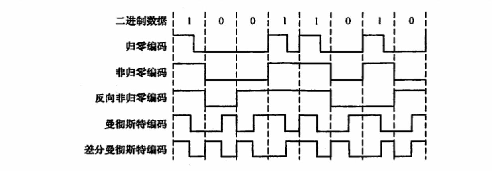

# 第一章
## 1.1 计算机网络概述
### 计算机网络的概念
资源共享 信息传递 自治

### 计算机网络的组成
从组成部分看：硬件 软件 协议
从工作方式看：边缘部分（供用户使用的主机） 核心部分（网络和路由器）  
从功能组成看：通信子网 资源子网
- 其中，通信子网对应于低三层（物理层、数据链路层、网络层），资源子网对应于高三层（会话层、表示层、应用层）

### 计算机网络的功能
数据通信 资源共享 分布式处理(利用空闲资源提高系统利用率) 提高可靠性 负载均衡

### 计算机网络的分类
##### 按分布范围分类
广域网(WAN)、城域网(MAN)、局域网(LAN)、个人局域网(PAN)

##### 按传输技术分类
广播式网络 所有计算机共享一个公共信道
- 局域网基本都采用广播式通信技术

点对点网络 每条线路连接一对计算机  
两台主机没有直接连接，就需要中间节点  
- 广域网基本都属于点对点传输

区别在于是否采用分组存储转发与路由选择机制

##### 按拓扑结构分类
主要分为总线形、星形、环形、网状

##### 按使用者分类
公用网、专用网

##### 按交换技术分类
###### 电路交换
优点：
- 通信时延小
- 有序传输
- 没有冲突
- 适用范围广
- 实时性强
- 控制简单

缺点：
- 建立连接时间长
- 线路独占，使用率低
- 灵活性差
- 难以规格化

###### 报文交换
优点：
- 无需建立连接
- 动态分配线路
- 提高线路可靠性
- 提高线路利用率
- 提供多目标服务

缺点：
- 引起转发时延
- 需要较大缓存空间
- 需要传输额外的信息量

###### 分组交换
优点：
- 无需建立连接
- 提高线路利用率高
- 加速传输
- 减少出错概率和重发数据量

缺点：
- 引起转发时延
- 需要传输额外的信息量
- 对于数据报服务，存在失序、丢失、重复分组的问题
- 对于虚电路服务，存在呼叫建立、数据传输、虚电路释放三个过程

##### 按传输介质分类
分为有线和无线两大类，可以向下细分

### 计算机网络的性能指标  
##### 数据量
单位b，8bit = 1B，KB = $2^{10}$B

##### 速率(数据率)
单位b/s，kb/s = $10^3$b/s

##### 带宽
最高数据率，单位b/s

##### 时延
- 发送时延 = 分组长度 / 信道宽度
- 传播时延 = 信道长度 / 传播速率
- 处理时延
- 排队时延
排队时延和处理时延一般忽略不计  

##### 时延带宽积
发送端发送的第一个比特到达终点时，发送端发送了多少比特  
传播时延 * 信道带宽

##### 往返时延(RTT)
从发送端发送数据开始，到发送端受到来自接收端的确认经历的时延

##### 吞吐量
单位时间内通过某个网络的数据量

##### 信道利用率
某一信道有百分之多少的时间是有数据通过的

## 1.2 计算机网络体系结构与参考模型
### OSI七层模型
- 应用层
  - 通过应用进程间的交互完成特定的网络应用
- 表示层
- 会话层
- 运输层
  - 如何解决进程之间基于网络的通信问题
  - 出现传输错误的时候如何处理
- 网络层
  - 如何标识个网络以及各网络中的各主机(IP地址)
  - 路由器如何进行转发分组，如何进行路由选择
- 数据链路层
  - 如何标识网络中的各主机(MAC地址)
  - 如何从信号表示的一连串比特流中区分出地址和数据
  - 如何协调各主机争用总线
- 物理层
  - 采用怎样的传输媒体
  - 采用怎样的物理接口
  - 使用怎样的信号表示0和1

OSI模型是法律上的国际标准
教学中一般采用五层模型

### TCP/IP四层模型
- 应用层
- 运输层
- 网际层
- 网络接口层

TCP/IP模型是事实上的国际标准

### 一些概念
实体
- 任何可发送或接收信息的硬件或软件进程

对等实体
- 收发双方相同层次中的实体

协议
- 控制两个对等实体进行逻辑通信的规则的集合
- 语法
  - 定义交换信息的格式
- 语义
  - 定义收发双方要完成的操作
- 同步
  - 定义收发双方的时序关系

服务
- 在协议的控制下，两个对等实体间的逻辑通信可以向上一层提供服务，协议是水平的，服务是垂直的
- 要实现本层协议要使用下一层提供的服务，下一层的协议对上一层的实体是透明的
- 服务可以按三种方式分类
  - 面向连接与无连接
  - 可靠与不可靠
  - 有应答和无应答

接口
- 同一结点内相邻两层间交换信息的连接点
- 同一结点相邻两层的实体通过服务访问点SAP进行交互。服务通过SAP提供给上层使用

# 第二章
## 2.1通信基础
### 物理层基本概念
物理层的主要任务是确定与传输媒体的接口有关的一些特性，即机械特性、电气特性、功能特性、过程特性  
数据
- 传送信息的实体
- 传输方式分为串行传输和并行传输
  - 串行传输一般用于远距离，更加经济。并行传输用于近距离，更加快

信号
- 数据的电气或电磁表现

码元
- 用一个固定时长的信号波形表示一位k进制数字，这个时长内的信号称为k进制码元，时长称为码元宽度

数据通信系统分为信源、信道、信宿三部分。信源是发送数据的源头，信宿是接收数据的终点。发送端信源发送的信息要经过变换器转换成适合在信道上传输的信号，接收端经过反变换器转换成原始信息  
信道传输的信号分为基带信号和宽带信号。基带信号直接将0和1用电压表示，在数字信道上传输，称为基带传输。宽带信号将基带信号调制成模拟信号，在模拟信道上传输，称为宽带传输。
从通信双方的交互方式看，分为单工、半双工、全双工

速率
- 单位时间内传输的数据量
- 码元传输速率
  - 单位时间内数字通信系统传输的码元个数
  - 单位是波特，1波特表示每秒传输一个码元
- 信息传输速率
  - 单位时间内数字通信系统传输的二进制码元个数
  - 单位是比特/秒

带宽指信号的频带宽度，单位赫兹

### 香农定理 奈氏准则
##### 奈奎斯特定理
理想信道(没有噪声，带宽有限)的信道中，极限码元传输率为$2W$波特，其中$W$为带宽，单位为赫兹  
如果有V种不同的码元，极限数据传输率为$2Wlog_2V$
- 在任何信道中，码元传输速率有上限，超过上限会出现码间串扰问题，无法完全正确识别码元
- 信道频带越宽，就可以用更高速率进行码元有效传输
- 奈氏准则未对信息传输速率给出限制

要提高数据传输率，要设法使每个码元携带更多信息量。为此需要采用多元制的调制方法

##### 香农定理
信道极限数据传输率 = $Wlog_2(1 + S/N)$b/s
S为信道传输信号的平均功率，N为信道内部的高斯噪声功率，S/N为信噪比
信噪比 = $10log_{10}(S/N)$ 单位dB
- 信道的带宽和信噪比越大，信息极限传输速率越高
- 对一定的带宽和信噪比，信息传输速率的上限是确定的
- 只要信息传输速率低于极限速率，就能找到某种方法实现无差错传输
- 实际能达到的传输速率比极限速率低不少

### 编码与调制
来自信源的信号称为基带信号，其中往往包含低频分量或直流分量，许多信道不能传输。因此要对信号进行调制
调制分为两大类。一类仅对信道特性相适应，变换后仍是基带信号，这类称为基带调制，也称编码。另一类调制需要使用载波，把基带信号的频率范围转移到较高的频段，转换为模拟信号，经过调制后的信号称为带通信号，这个过程称为带通调制。
##### 常用编码方式

归零制：正脉冲代表1，负脉冲代表0
不归零制：正电平代表1，负电平代表0
曼彻斯特编码：为周期中心的向上跳变代表1，向下跳变代表0。可以反过来定义
差分曼彻斯特编码：每一位的中心市场中有跳变。位开始边界有跳变代表0，否则代表1
##### 基本带通调制方法
调幅：载波的振幅随基带数字信号而变化
调频：载波的频率随基带数字信号而变化
调相：载波的初始相位随基带数字信号而变化
为了达到更高的信息传输速率。必须采用更为复杂的多元制的混合调制方法，例如正交振幅调制
### 数据报与虚电路
| | 数据报服务 | 虚电路服务 |
| --- | --- | --- |
| 连接建立 | 不需要 | 需要 |
| 目的地址 | 每个分组都包括发送端和接收端的完整地址 | 仅在建立连接阶段使用，之后每个分组使用长度较短的虚电路号 |
| 分组顺序 | 不保证分组的有序到达 | 保证分组有序到达 |
| 可靠性 | 不保证可靠通信，可靠性由用户主机保证 | 可靠通信 |
| 对网络故障的适应性 | 出故障的节点丢失分组，其他分组路径选择变化时正常传输 | 所有经过故障节点的虚电路不能正常工作 |
| 差错处理和流量控制 | 由用户主机进行流量控制，不保证数据报的可靠性 | 可由分组交换网或用户主机负责 |